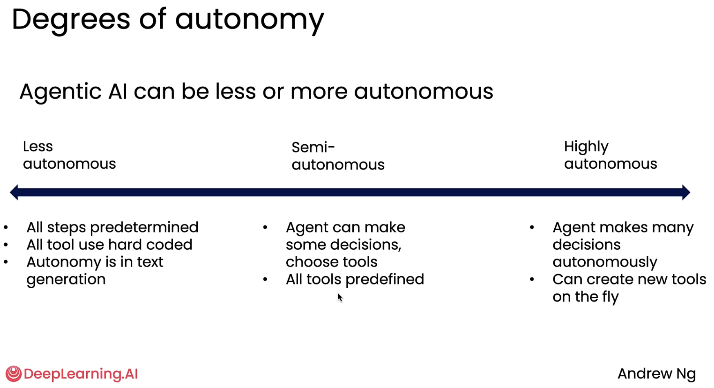
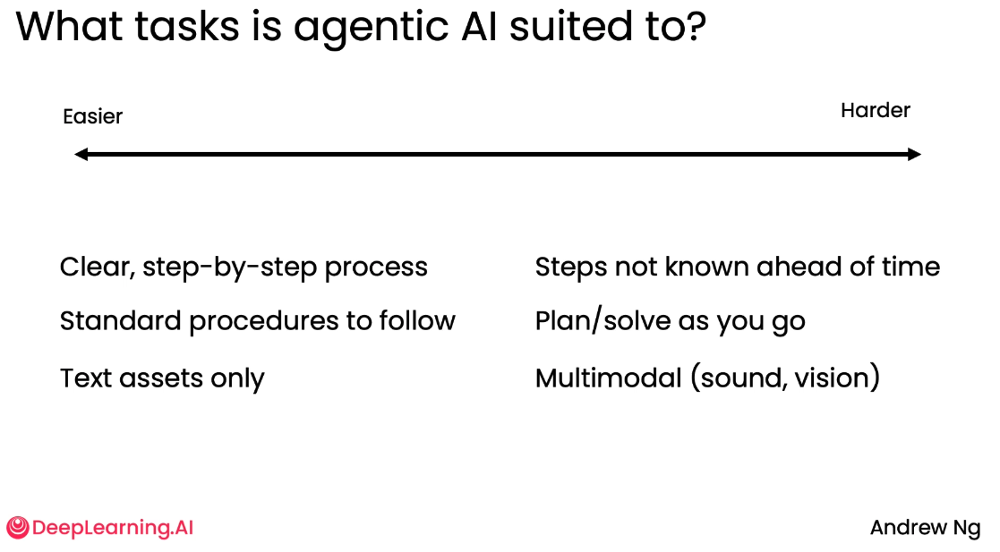

# Module 1: Introduction to Agentic AI

## What is Agentic AI

> An Agentic AI workflow is a process where an LLM-based application executes multiple steps to complete a task.

Example: an essay-writing app
- write an essay outline on a topic (LLM)
- do need any web research? (LLM + websearch tool)
- write a first draft
- consider what parts need revision or more research.
- revise the draft
- ...

## Degrees of autonomy

## Benefits of Agentic AI

Key benefits of Agentic workflows

- Much better performance
- Faster than humans because of parallelism
- Modular: can add or update tools, swap-out models

## Building blocks

- Models
  - LLMs: for text generation, tool use, information extraction, thinking
  - Other AI models: text2speech, speech2text, image analysis, OCR
- Tools
  - API: websearch, send emails
  - Information retrieval: DB, RAG
  - Code execution: data analysis, maths, ...

## Evaluation of agentic AI

- Can evaluate using codes (static evals), or LLM-as-judge (more flexible)
- Two types of evals: end-to-end and component-level
- Examine the traces to perform error analysis

## Agentic Design Patterns

- Reflection
- Tool use
- Planning
- Multi-agent collaboration

# Module 2: Reflection Design Pattern

