# Module 1: Introduction to Agentic AI

## What is Agentic AI

> An Agentic AI workflow is a process where an LLM-based application executes multiple steps to complete a task.

Example: an essay-writing app
- write an essay outline on a topic (LLM)
- do need any web research? (LLM + websearch tool)
- write a first draft
- consider what parts need revision or more research.
- revise the draft
- ...

## Degrees of autonomy


## Benefits of Agentic AI

Key benefits of Agentic workflows

- Much better performance
- Faster than humans because of parallelism
- Modular: can add or update tools, swap-out models

## Building blocks

- Models
  - LLMs: for text generation, tool use, information extraction, thinking
  - Other AI models: text2speech, speech2text, image analysis, OCR
- Tools
  - API: websearch, send emails
  - Information retrieval: DB, RAG
  - Code execution: data analysis, maths, ...

## Evaluation of agentic AI

- Can evaluate using codes (static evals), or LLM-as-judge (more flexible)
- Two types of evals: end-to-end and component-level
- Examine the traces to perform error analysis

## Agentic Design Patterns

- Reflection
- Tool use
- Planning
- Multi-agent collaboration

# Module 2: Reflection Design Pattern

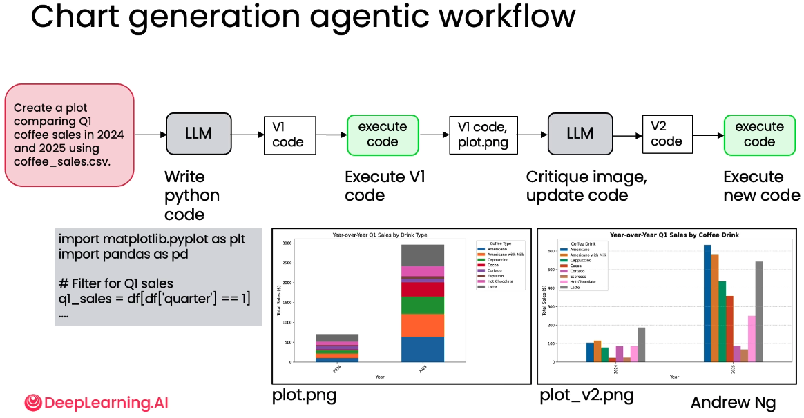

## Evaluation

- Objective evals
  - Code-based evals are easier
  - Need a dataset of ground truth examples
- Subjective evals
  - Use LLM as a judge
  - Rubric-based grading is better

### LLM as a judge

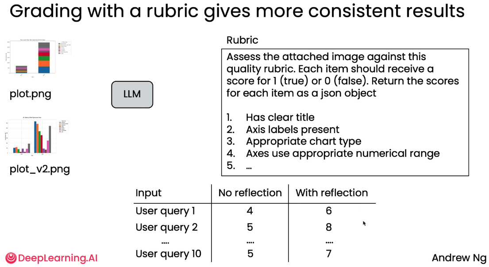

## Using external feedback

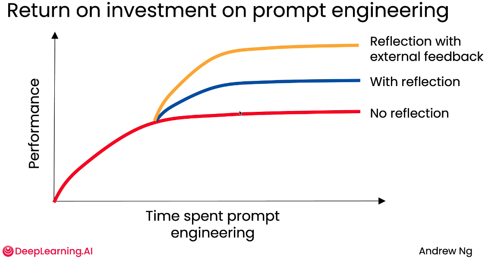

# Module 3: Tool Use

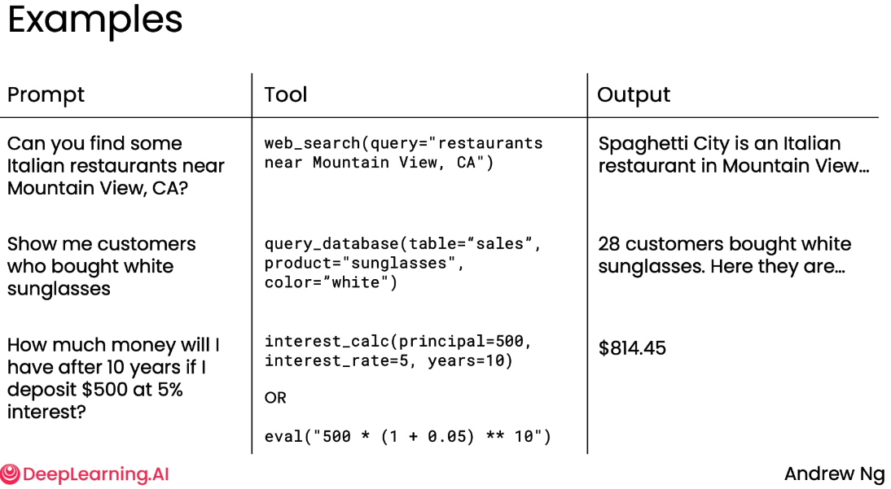

## MCP

# Practical tips for building Agentic AI

## Evaluations (evals)

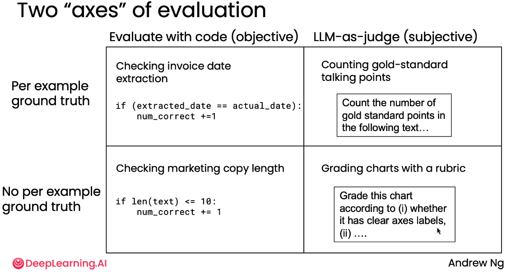

- Quick and dirty is ok to start
- As you find places where your evals fail to capture human judgement as to what system is better, us that as an opportunity to improve the metric
- Look for places where performance is worse than humans

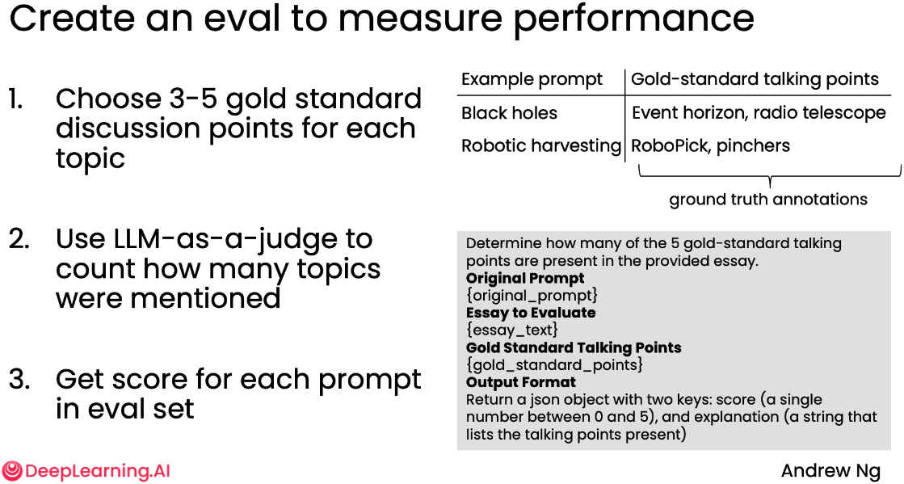

## Error analysis and prioritizing next steps

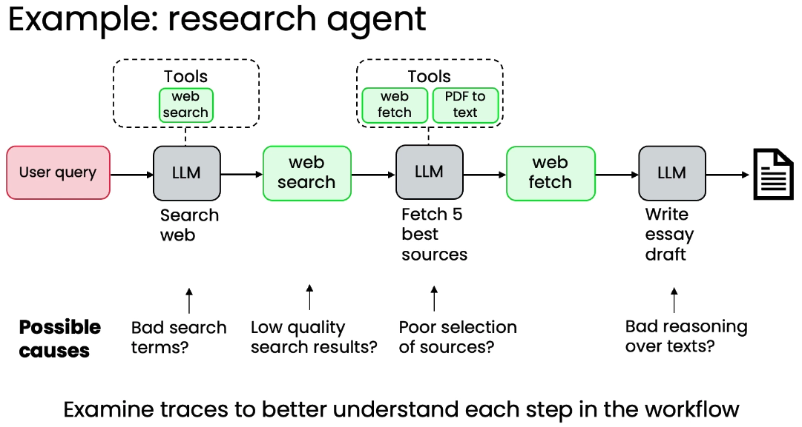

| Prompt                                   | Search Terms      | Search Result                           | Picking 5 best sources  | ... |
| ---------------------------------------- | ----------------- | --------------------------------------- | ----------------------- | --- |
| Recent development in black hole science |                   | Too many blog posts, not enough papers  |                         |     |
| Renting vs buying a home in Seattle      |                   |                                         | missed well known blogs |     |
| Robotics for harvesting fruits           | Terms too generic | Websites for elementary school students |                         |     |
| ...                                      | ...               | ...                                     | ...                     | ... |
| Batteries for electric vehicles          |                   | ONly selected US-based companies        | Missed magazine         |     |
|                                          | 5%                | 45%                                     | 10%                     | ... |

Tips:

- Develop a habit of looking at traces
- Carry out error analysis to figure out what component performed poorly, leading to a poor final output
- Use error analysis output to decide where to focus efforts


# Patterns for Highly autonomous agents

## Planning workflows

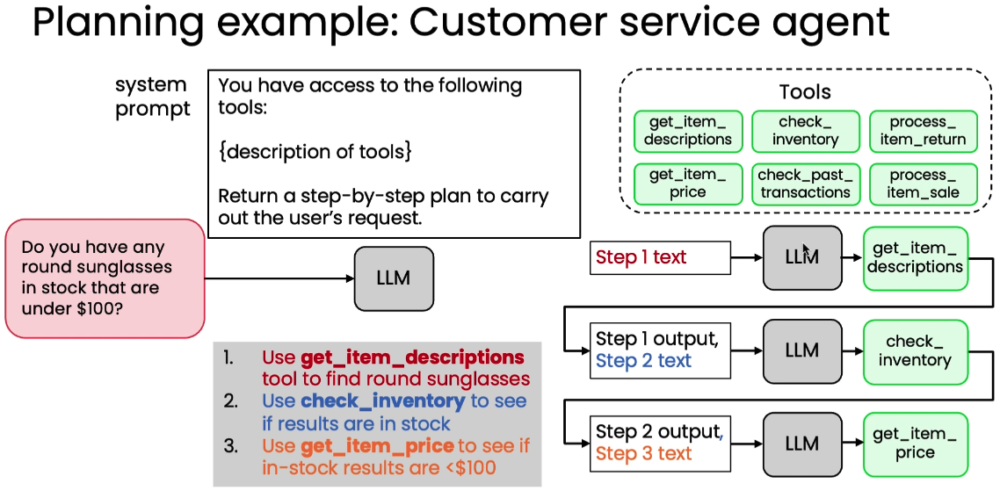

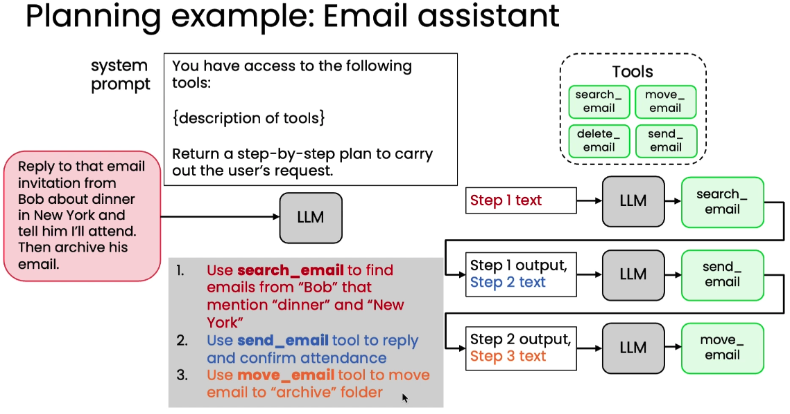

## Creating and Executing LLM plans

### Formatting plan as JSON

System Prompt:
```text
You have access to the following tools:

{descriptions of tools}

Create a step-by-step plan in Json format.
Each step should have the following items: step number, description, tool name, and arguments.
```

Query:
```text
Do you have any round sunglasses in stock that are under $100?
```

-> LMM -> Plan:
```json
{
    "plan": [
        {
            "step": 1,
            "description": "Find round sunglasses",
            "tool": "get_item_descriptions",
            "arguments": { "query": "round glasses" }
        },
        {
            "step": 2,
            "description": "Check available stock",
            "tool": "check_inventory",
            "arguments": { "items": "results from step 1" }
        },
        ...
    ]
}
```

### Planning with code execution

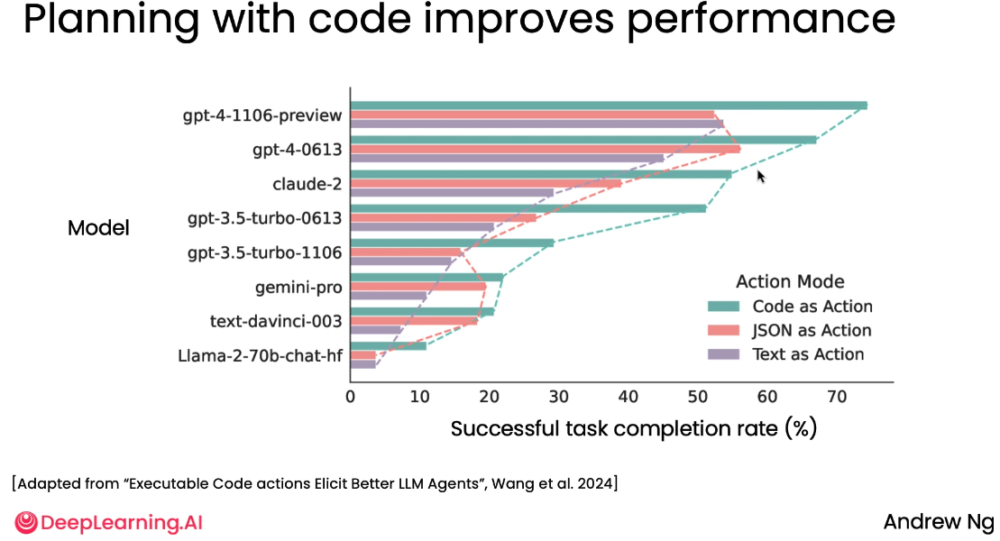

## Multi-agentic workflows

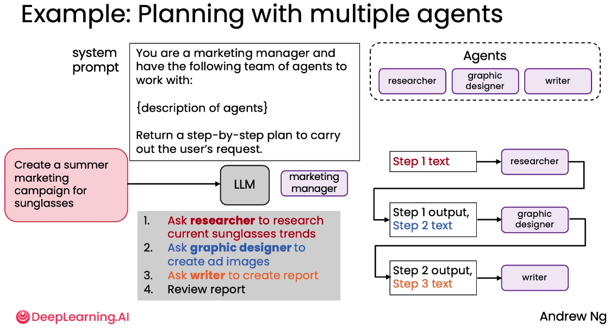

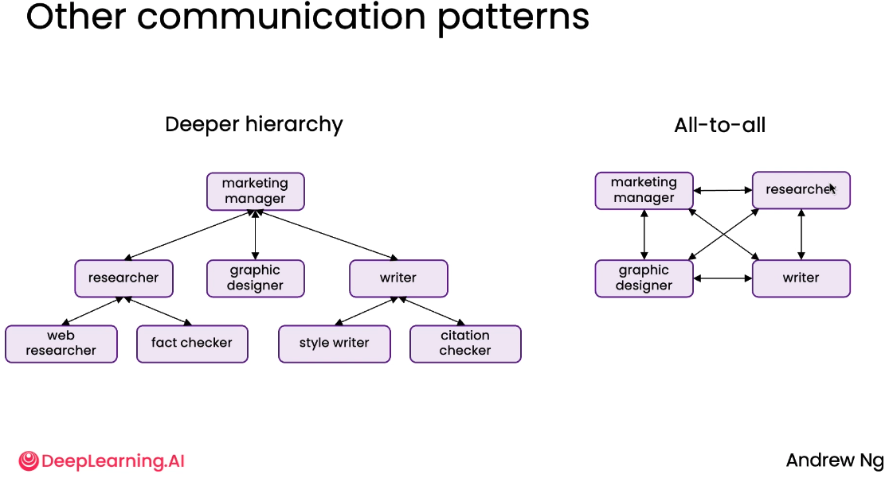


# Summary

- Why Agentic AI
- Agentic Design Patterns:
  - Reflection pattern
  - Tool-use pattern
  - Planning pattern
  - Multi-agent pattern
- Evals, error analysis